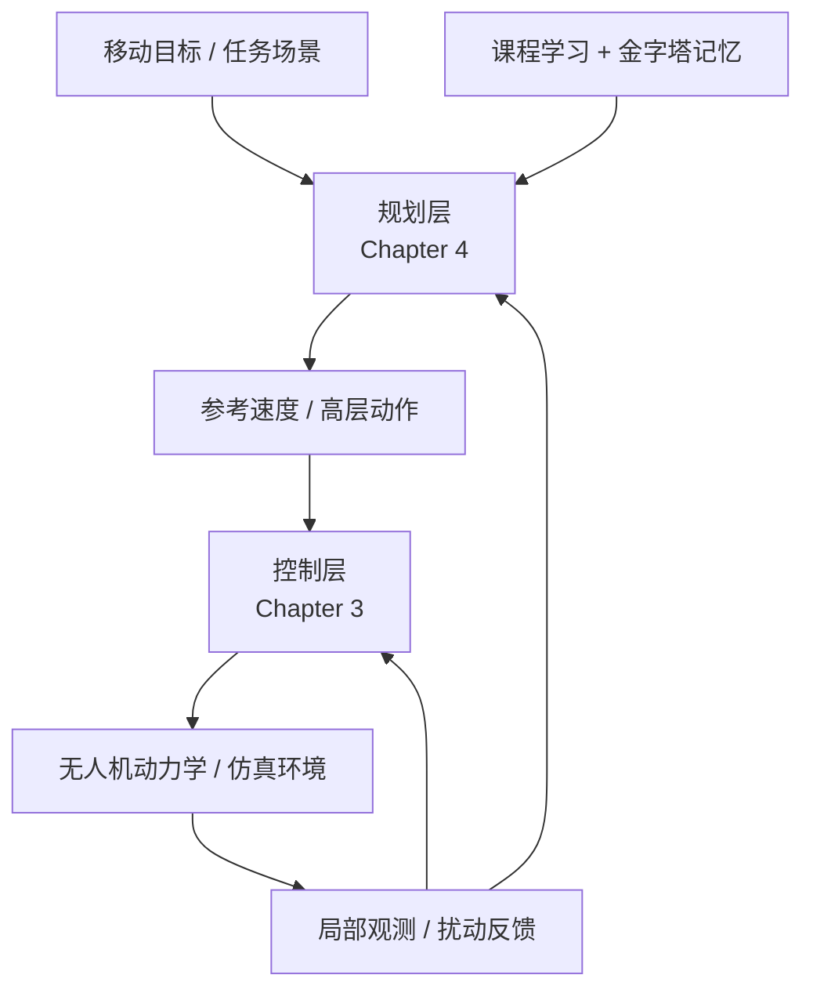

# lc

面向硕士论文研究的多无人机分层强化学习代码与论文协同仓库。

本项目不是一个单纯的“RL 算法练习集”，也不是一个只存放论文 `.tex` 的写作目录，而是一个围绕论文问题持续演化的代码-论文一体化工作区。仓库当前聚焦两条核心研究主线：

- 第三章：运动控制层，基于 RL-LADRC 的鲁棒自适应控制
- 第四章：规划策略层，基于任务分解注意力网络、课程学习与金字塔记忆的多无人机协同规划

## 摘要

整篇论文采用“规划层 + 控制层”的双层智能协同架构：

- 上层规划负责移动目标驱动下的协同避障、占位与编队决策
- 下层控制负责将规划输出稳定执行到真实或仿真动力学系统
- 论文与代码同步推进，任何重要方法变更都需要同时检查论文描述、实验脚本与源码结构

当前仓库同时包含两类内容：

- 论文主线实现与实验接口
- 历史实现、通用 RL 框架与待迁移模块

因此，理解本仓库时最重要的一点是：要区分“论文主链路代码”和“历史目录/迁移中目录”。

## 研究主线

### 第三章：控制层

第三章聚焦于多无人机系统的高频运动控制问题，核心目标是：

- 保留 LADRC 的工程稳定性与抗扰特性
- 通过强化学习实现关键参数在线自适应调节
- 用跨时间样本增强缓解惯性、延迟和频率失配带来的学习困难

当前代码中，第三章相关接口主要汇聚在：

- [src/lc/control/chapter3_interfaces.py](/C:/context_mine/mine_code/GIT_Projects/lc/src/lc/control/chapter3_interfaces.py)
- [src/lc/system/chapter34_bridge.py](/C:/context_mine/mine_code/GIT_Projects/lc/src/lc/system/chapter34_bridge.py)

历史实现仍位于 `Gym_env/`、`Trainer/` 等目录。

### 第四章：规划层

第四章聚焦于面向移动目标的多无人机协同包围/协同避障规划问题，核心目标是：

- 用任务分解结构处理“安全避障”和“协同编队”的目标冲突
- 用课程学习实现从简单到复杂、从单机到多机的渐进学习
- 用金字塔经验池缓解持续学习中的遗忘与阶段切换震荡

当前代码中，第四章相关主链路主要在：

- [src/lc/planning/chapter4_interfaces.py](/C:/context_mine/mine_code/GIT_Projects/lc/src/lc/planning/chapter4_interfaces.py)
- [src/lc/planning/models/multi_uav_model.py](/C:/context_mine/mine_code/GIT_Projects/lc/src/lc/planning/models/multi_uav_model.py)
- [src/lc/planning/memory/](/C:/context_mine/mine_code/GIT_Projects/lc/src/lc/planning/memory)
- [src/lc/env/evolution_scenarios.py](/C:/context_mine/mine_code/GIT_Projects/lc/src/lc/env/evolution_scenarios.py)

## 系统架构



从论文叙事上，这个系统要始终保持以下逻辑：

- 第四章回答“高层意图如何正确生成”
- 第三章回答“高层意图如何被稳定执行”
- 两章合起来才构成完整的分层智能协同闭环

## 快速开始

### 环境要求

- Python `>= 3.10`
- 核心依赖：`torch`、`numpy`、`gym`、`gymnasium`、`pandas`、`loguru`

项目依赖定义见 [pyproject.toml](/C:/context_mine/mine_code/GIT_Projects/lc/pyproject.toml)。

### 安装依赖

如果你使用 `uv`：

```powershell
uv sync
```

如果你使用 `pip`：

```powershell
pip install -e .
```

### 常用运行入口

#### 论文接口 smoke test

```powershell
python -m unittest tests.smoke.test_chapter34_interfaces
```

#### 第三章接口实验

```powershell
python experiments\control\run_chapter3_experiment.py
```

#### 第四章接口实验

```powershell
python experiments\planning\run_chapter4_experiment.py
```

#### 第三章 + 第四章桥接演示

```powershell
python experiments\integrated\run_chapter34_demo.py
```

#### 历史统一训练入口

```powershell
python main.py --algo ppo --env-id HoverAviary-v0
```

注意：

- 上述 `main.py` 仍是旧链路入口，不代表 `src/` 迁移已经完成。
- 若后续迁移收敛完成，应优先以 `src/` 下的训练/实验入口替代它。

## 仓库结构

### 论文主链路目录

- `src/lc/`
  当前正在建设中的论文主链路源码目录，目标是承载后续全部执行型代码。
- `experiments/`
  面向第三章、第四章和系统联调的实验入口。
- `tests/`
  smoke tests 与接口验证。
- `papers/`
  论文 LaTeX 源文件、章节内容与参考文献。

### 历史实现与待迁移目录

- `Gym_env/`
  环境、PyBullet 无人机仿真、控制器与环境包装。
- `NN/`
  神经网络模型与历史版任务分解网络实现。
- `Reinforce_learning/`
  通用 RL 算法、经验池与采样器等历史实现。
- `Trainer/`
  训练流程与 trainer 历史实现。
- `configs/`
  旧训练主入口使用的配置目录。
- `main.py`
  当前仍然依赖旧目录的统一训练入口。

### 配套资料目录

- `docs/`
  架构说明、清理候选、写作辅助文档。
- `examples/`
  示例训练脚本，当前大多仍依赖旧目录。
- `core_architecture/`
  系统架构概念表达与早期结构化设计。
- `daily/`
  研究过程记录与阶段性材料。

## 代码现状与迁移状态

你设定的长期目标是：后续全部有关执行的代码都迁移到 `src/` 中，其他位置代码逐步转移、冻结或退出主链路。

根据当前仓库状态，这项工作还没有彻底完成，现状如下：

### 已经完成或基本完成的部分

- 第三章/第四章的章节接口封装已在 `src/lc/control`、`src/lc/planning`、`src/lc/system` 中建立
- `experiments/` 和部分 `tests/` 已经开始直接调用 `src/lc/*`
- 第四章主模型的代码口径已对齐到 `MultiUAVModel`
- 第三章、第四章桥接演示已经能通过 `src` 主链路接口打通

### 仍未完成的部分

- [main.py](/C:/context_mine/mine_code/GIT_Projects/lc/main.py) 仍直接依赖 `Gym_env`、`NN`、`Reinforce_learning`、`Trainer`
- `examples/` 仍大量依赖旧目录
- `src/lc` 中仍存在不少占位包和待迁移骨架
- 老目录和 `src` 目录之间仍存在重复抽象
- 全仓还没有完成“所有执行代码均从 `src/` 运行”的最终收敛

换句话说：

- `src/` 已经成为论文主链路的目标代码目录
- 但整个仓库还没有完成彻底迁移

如果你要继续推进这项工作，建议优先参考：

- [docs/src_lc_cleanup_candidates.md](/C:/context_mine/mine_code/GIT_Projects/lc/docs/src_lc_cleanup_candidates.md)

## 论文主线代码映射

### 第三章：控制层

- 方法主题：RL-LADRC 自适应参数控制
- 关键问题：固定参数难兼顾响应速度、平滑性与抗扰性
- 核心机制：RL 调参、动作保持、状态叠加、N 步回报
- 当前接口映射：
  - [src/lc/control/chapter3_interfaces.py](/C:/context_mine/mine_code/GIT_Projects/lc/src/lc/control/chapter3_interfaces.py)
  - [experiments/control/run_chapter3_experiment.py](/C:/context_mine/mine_code/GIT_Projects/lc/experiments/control/run_chapter3_experiment.py)

### 第四章：规划层

- 方法主题：任务分解双流注意力规划网络 + 课程学习 + 金字塔经验池
- 关键问题：安全避障与协同规划目标冲突、变长输入、持续学习遗忘
- 核心机制：
  - `MultiUAVModel` 作为论文图示主实现
  - `ObstacleAvoidanceBranch` 先提取安全语义
  - `CollaborativeBranch` 在安全特征基础上做协作修正
  - `TaskDecomposedActor` 作为轻量化实验接口保留
  - `MultiLevelBuffer` / `PyramidPER` 作为第四章记忆机制接口
- 当前接口映射：
  - [src/lc/planning/chapter4_interfaces.py](/C:/context_mine/mine_code/GIT_Projects/lc/src/lc/planning/chapter4_interfaces.py)
  - [src/lc/planning/models/](/C:/context_mine/mine_code/GIT_Projects/lc/src/lc/planning/models)
  - [src/lc/planning/memory/](/C:/context_mine/mine_code/GIT_Projects/lc/src/lc/planning/memory)
  - [experiments/planning/run_chapter4_experiment.py](/C:/context_mine/mine_code/GIT_Projects/lc/experiments/planning/run_chapter4_experiment.py)

### 系统桥接层

- 功能：把第三章控制层与第四章规划层放到同一条实验叙事链上
- 当前接口映射：
  - [src/lc/system/chapter34_bridge.py](/C:/context_mine/mine_code/GIT_Projects/lc/src/lc/system/chapter34_bridge.py)
  - [experiments/integrated/run_chapter34_demo.py](/C:/context_mine/mine_code/GIT_Projects/lc/experiments/integrated/run_chapter34_demo.py)

## 实验与测试组织

### `experiments/`

该目录用于放论文实验入口，而不是通用训练杂项。

当前包括：

- `experiments/control/`
  第三章控制层相关实验
- `experiments/planning/`
  第四章规划层相关实验
- `experiments/integrated/`
  章节桥接与联调演示
- `experiments/legacy/`
  旧实验与历史保留入口

### `tests/`

当前测试以 smoke test 为主，重点验证：

- 章节接口是否可用
- 第三章和第四章的桥接是否可跑通
- 第四章模型输入输出是否符合当前接口约定

建议后续逐步补充：

- 第三章控制层参数边界测试
- 第四章模型字典输入/扁平输入兼容测试
- 金字塔记忆采样比例与课程阶段联动测试

## 推荐阅读顺序

### 如果你想先理解论文主链路

建议按这个顺序阅读：

1. [papers/chapters/ch3_control.tex](/C:/context_mine/mine_code/GIT_Projects/lc/papers/chapters/ch3_control.tex)
2. [papers/chapters/ch4_planning.tex](/C:/context_mine/mine_code/GIT_Projects/lc/papers/chapters/ch4_planning.tex)
3. [src/lc/control/chapter3_interfaces.py](/C:/context_mine/mine_code/GIT_Projects/lc/src/lc/control/chapter3_interfaces.py)
4. [src/lc/planning/chapter4_interfaces.py](/C:/context_mine/mine_code/GIT_Projects/lc/src/lc/planning/chapter4_interfaces.py)
5. [src/lc/system/chapter34_bridge.py](/C:/context_mine/mine_code/GIT_Projects/lc/src/lc/system/chapter34_bridge.py)
6. [experiments/](/C:/context_mine/mine_code/GIT_Projects/lc/experiments) 与 [tests/](/C:/context_mine/mine_code/GIT_Projects/lc/tests)

### 如果你想理解历史训练框架

建议继续阅读：

1. [main.py](/C:/context_mine/mine_code/GIT_Projects/lc/main.py)
2. `Gym_env/`
3. `NN/`
4. `Reinforce_learning/`
5. `Trainer/`

## README 使用建议

如果你后续继续调整论文和代码，建议把 README 始终维持成“仓库主页”，只放这些内容：

- 仓库研究定位
- 当前主链路
- 目录职责
- 运行入口
- 迁移状态
- 推荐阅读顺序

更细的写作安排、章节提纲和章节-代码映射细节，建议单独维护在文档里：

- [docs/chapter3_chapter4_full_guide.md](/C:/context_mine/mine_code/GIT_Projects/lc/docs/chapter3_chapter4_full_guide.md)

## 后续建议路线

如果后续目标是彻底收敛到 `src/`，建议按这个顺序推进：

1. 清理 `src/lc` 中的 `__pycache__` 和无实现占位骨架
2. 明确 `src/lc` 中哪些模块是论文主链路保留项
3. 将 `main.py` 的环境、模型、算法、trainer 依赖逐步改为 `src/` 实现
4. 将 `examples/` 中仍调用旧目录的脚本迁移到 `src` 接口
5. 在迁移完成后，给旧目录打上 `legacy` 标识或整体归档

## 相关文档

- [docs/CODEBASE_EXPLANATION.md](/C:/context_mine/mine_code/GIT_Projects/lc/docs/CODEBASE_EXPLANATION.md)
- [docs/src_lc_cleanup_candidates.md](/C:/context_mine/mine_code/GIT_Projects/lc/docs/src_lc_cleanup_candidates.md)
- [docs/chapter3_chapter4_full_guide.md](/C:/context_mine/mine_code/GIT_Projects/lc/docs/chapter3_chapter4_full_guide.md)
- [项目与论文概览.md](/C:/context_mine/mine_code/GIT_Projects/lc/项目与论文概览.md)

## 一句话总结

这个仓库的正确理解方式是：

“它是一个以硕士论文为中心、正在从历史 RL 框架向 `src/` 论文主链路源码收敛的多无人机分层强化学习研究仓库。”
