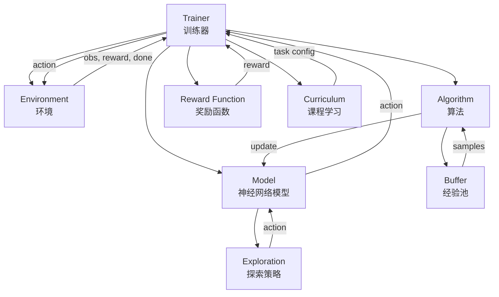
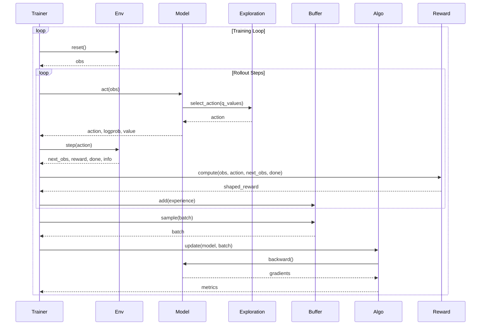

# lc - 强化学习框架

基础的强化学习算法实现，用于学习和理解强化学习的基本概念和算法。
代码实现了多种经典的强化学习算法，适合初学者和研究人员参考。

## 项目特点

- **模块化设计**：各模块高度解耦，便于理解和扩展
- **统一接口**：各模块通过抽象基类定义统一接口，易于替换和组合
- **易于扩展**：提供基础类，方便实现自定义的探索策略、奖励函数、经验池等
- **学习友好**：代码结构清晰，注释详细，适合学习和研究

## 目录结构

```
lc/
├── Gym_env/                    # 环境模块
│   ├── BaseEnv.py             # 环境接口定义
│   └── gym_pybullet_drones/   # PyBullet无人机仿真环境
├── NN/                         # 神经网络模块
│   ├── BaseNN.py              # 神经网络基类接口
│   ├── components.py          # Transformer组件
│   ├── embeddings.py          # 嵌入层
│   ├── obstacle_branch.py     # 避障分支
│   ├── collaborative_branch.py # 协作分支
│   └── MultiUAVModel.py       # 多无人机模型
├── Reinforce_learning/         # 强化学习算法模块
│   ├── Basealgos.py           # 算法基类接口
│   ├── exploration/           # 探索策略模块
│   │   └── BaseExploration.py # 探索策略基类
│   ├── buffers/               # 经验池模块
│   │   └── BaseBuffer.py     # 经验池基类
│   └── RLg/                  # 具体算法实现
├── Trainer/                    # 训练器模块
│   ├── BaseTrainer.py         # 训练器基类
│   ├── rewards/               # 奖励函数模块
│   │   └── BaseReward.py     # 奖励函数基类
│   └── curriculum/            # 课程学习模块
│       └── BaseCurriculum.py # 课程学习基类
└── utils/                      # 工具模块
    ├── logger.py              # 日志工具
    └── draw_pic.py            # 绘图工具
```

## 仿真环境

针对于我的问题，我使用的仿真环境是gymnasium，这个环境是基于gym的，但是比gym更加完善，支持更多的环境。同时控制的为UAVs
所以采用的是无人机的仿真环境，具体的环境可以参考github上的代码。这部分的机器人参数和底层pid控制并不是我写的，而是参考的别人的代码。后续的强化学习也没有研究运动控制而是对于轨迹规划的强化学习研究。

## 神经网络

虽然初始的强化学习和神经网络的部分没有什么联系，但是后续升级为深度强化学习的时候，需要用到神经网络来进行函数逼近。所以这里我也实现了一些神经网络的算法。这也是我认为强化学习创新的一个方向，使用现在新型的神经网络架构或者更改设计增强效果。

常见也是我见过最大的是nature发表的对于 持续强化学习进行的神经网络改变：增加残差、失活率等。

## 算法架构

强化学习可以分为：值函数学习、策略学习；在线学习、离线学习；离散、连续。
对于控制的实际问题很大程度为：连续、离线、策略学习。

- 连续指的是动作的控制参数是连续的，当然有些问题可以简化为离散的。
- 离线是指的并不是根据当前经验样本进行学习，而是有一个收集累计的过程。也就是需要有一个经验池来存储采样的经验。
- 策略学习是指的是通过学习一个策略来控制环境，而不是学习一个值函数，直接采用最大值对应的策略。

算法具体部分有：

- 探索： 怎么探索，怎么平衡探索和利用。  探索的方法有很多，比如epsilon-greedy、softmax、boltzmann等。 探索的方法可以更改，增加新的方法。 探索的方法可以更改，增加新的方法。
- 样本： 怎么采集的，样本质量如何，怎么存储的。  样本是怎么提取的，怎么使用的。 大多是经验池部分的改进
- 算法公式： 对于算法理解深入的部分，公式推导。可以更改部分参数或者增加部分参数信息，提高学习效率或者其他。

## 项目架构

### 整体架构图



### 数据流图



## 接口设定与解耦逻辑

### 1. 环境接口 (`Gym_env/BaseEnv.py`)

环境模块定义了统一的接口，不绑定具体的gymnasium实现，便于替换后端。

#### VectorEnvLike - 环境统一接口

**核心属性：**

- `num_envs`: 并行环境数量
- `obs_shape`: 观测维度形状
- `action_shape`: 动作张量形状
- `is_discrete`: 动作空间是否离散
- `action_dim`: 动作维度/动作数量

**核心方法：**

- `reset(seed) -> obs`: 重置环境，返回初始观测
- `step(actions) -> (obs, rewards, dones, infos)`: 执行一步，返回结果

**接口设计原则：**

- 统一使用numpy数组作为输入输出
- 支持向量化环境（多环境并行）
- 返回格式标准化，便于后续处理

#### EnvConfig - 环境配置

```python
@dataclass
class EnvConfig:
    env_id: str                    # 环境标识符
    num_envs: int = 1              # 并行环境数
    seed: int = 0                  # 随机种子
    capture_video: bool = False    # 是否录制视频
    run_name: str = "exp"          # 日志命名
    max_episode_steps: Optional[int] = None  # 最大回合步数
```

#### EnvFactory - 环境工厂

负责根据配置创建环境实例，实现环境创建与使用的解耦。

### 2. 神经网络接口 (`NN/BaseNN.py`)

神经网络模块定义了Actor-Critic架构的统一接口。

#### BaseRLModel - 模型基类

**核心方法：**

- `forward_dist(obs) -> ActionDist`: 返回动作分布
- `value(obs) -> Tensor`: 返回状态价值 V(s)
- `act(obs) -> ActOutput`: 采样接口（用于训练）
- `evaluate(obs, actions) -> EvalOutput`: 评估接口（用于更新）

**接口设计原则：**

- 统一使用PyTorch Tensor
- 分离采样和评估接口，避免梯度计算混乱
- 通过ActionDist抽象动作分布，支持离散和连续动作

#### ActionDist - 动作分布接口

```python
class ActionDist(ABC):
    def sample(self) -> torch.Tensor          # 采样动作
    def log_prob(self, actions) -> torch.Tensor  # 计算对数概率
    def entropy(self) -> torch.Tensor         # 计算熵
```

#### ModelConfig - 模型配置

```python
@dataclass
class ModelConfig:
    hidden_sizes: Tuple[int, ...] = (64, 64)
    activation: str = "tanh"
    log_std_init: float = -0.5
```

### 3. 算法接口 (`Reinforce_learning/Basealgos.py`)

算法模块定义了强化学习算法的统一更新接口。

#### BaseAlgo - 算法基类

**核心方法：**

- `update(model, optimizer, batch) -> Dict[str, float]`: 执行一次参数更新

**接口设计原则：**

- 算法只负责参数更新逻辑，不关心数据采集
- 通过RolloutBatch统一数据格式
- 返回metrics字典，便于日志记录

#### RolloutBatch - 数据批次

```python
@dataclass
class RolloutBatch:
    obs: torch.Tensor            # (B, obs_dim)
    actions: torch.Tensor        # (B,) or (B, act_dim)
    old_logprobs: torch.Tensor   # (B,)
    advantages: torch.Tensor     # (B,)
    returns: torch.Tensor        # (B,)
    old_values: torch.Tensor     # (B,)
```

### 4. 训练器接口 (`Trainer/BaseTrainer.py`)

训练器模块负责整个训练流程的协调。

#### Trainer - 训练器主类

**核心职责：**

- 管理训练循环
- 协调环境、模型、算法的交互
- 处理数据采集和存储
- 计算GAE和returns
- 记录日志和指标

**训练流程：**

1. 初始化环境、模型、算法
2. 采样rollout（T步）
3. 计算GAE和returns
4. 调用算法更新模型
5. 记录日志
6. 重复直到达到最大步数

#### TrainConfig - 训练配置

```python
@dataclass
class TrainConfig:
    total_timesteps: int = 1_000_000
    num_steps: int = 128              # Rollout长度
    gamma: float = 0.99               # 折扣因子
    gae_lambda: float = 0.95         # GAE参数
    anneal_lr: bool = False           # 学习率退火
    log_interval: int = 10            # 日志间隔
    device: str = "cpu"               # 设备
```

### 5. 探索策略接口 (`Reinforce_learning/exploration/BaseExploration.py`)

探索策略模块定义了统一的探索接口，支持多种探索方法。

#### BaseExploration - 探索策略基类

**核心方法：**

- `select_action(action_values, deterministic) -> action`: 选择动作
- `update(step) -> None`: 更新探索参数
- `reset() -> None`: 重置状态
- `get_exploration_rate() -> float`: 获取当前探索率

**实现类：**

- `EpsilonGreedy`: epsilon-greedy策略（离散动作）
- `SoftmaxExploration`: softmax策略（离散动作）
- `NoiseExploration`: 高斯噪声探索（连续动作）
- `OUNoiseExploration`: OU噪声探索（连续动作）

**接口设计原则：**

- 支持离散和连续动作空间
- 统一的参数更新接口
- 可配置的衰减策略

### 6. 奖励函数接口 (`Trainer/rewards/BaseReward.py`)

奖励函数模块定义了统一的奖励计算接口，支持奖励塑形和课程学习。

#### BaseRewardFunction - 奖励函数基类

**核心方法：**

- `compute(obs, action, next_obs, done, info) -> reward`: 计算奖励
- `reset(episode) -> None`: 重置状态
- `get_reward_info() -> Dict`: 获取奖励信息

**实现类：**

- `ShapedReward`: 奖励塑形（基于势能或直接加权）
- `CurriculumReward`: 课程学习奖励（动态调整）
- `MultiObjectiveReward`: 多目标奖励（加权求和或Pareto）

**接口设计原则：**

- 支持奖励塑形和课程学习
- 可组合多个奖励函数
- 提供奖励相关信息用于分析

### 7. 经验池接口 (`Reinforce_learning/buffers/BaseBuffer.py`)

经验池模块定义了统一的经验存储和采样接口。

#### BaseBuffer - 经验池基类

**核心方法：**

- `add(state, action, reward, next_state, done, **kwargs) -> None`: 添加经验
- `sample(batch_size) -> Tuple`: 采样经验
- `update_priority(indices, priorities) -> None`: 更新优先级（可选）

**实现类：**

- `ReplayBuffer`: 标准经验回放（均匀采样）
- `PrioritizedReplayBuffer`: 优先经验回放（按TD误差采样）
- `MultiAgentBuffer`: 多智能体经验池（支持共享或独立缓冲区）

**接口设计原则：**

- 统一的添加和采样接口
- 支持优先回放（可选）
- 支持多智能体场景

### 8. 课程学习接口 (`Trainer/curriculum/BaseCurriculum.py`)

课程学习模块定义了统一的课程管理接口。

#### BaseCurriculum - 课程学习基类

**核心方法：**

- `get_current_task() -> Dict`: 获取当前任务配置
- `update(performance) -> bool`: 更新课程进度
- `is_complete() -> bool`: 判断是否完成

**实现类：**

- `DifficultyCurriculum`: 难度递增课程（根据成功率调整难度）
- `TaskCurriculum`: 任务序列课程（按预定义序列学习）

**接口设计原则：**

- 任务配置通过字典返回，灵活可扩展
- 根据性能指标自动调整课程
- 支持自定义性能指标

## 解耦设计原则

### 1. 接口抽象

每个模块都定义了抽象基类，具体实现通过继承基类实现：

- **环境模块**：`VectorEnvLike` 抽象接口，不绑定gymnasium
- **模型模块**：`BaseRLModel` 抽象接口，统一Actor-Critic架构
- **算法模块**：`BaseAlgo` 抽象接口，统一更新逻辑
- **探索策略**：`BaseExploration` 抽象接口，统一探索方法
- **奖励函数**：`BaseRewardFunction` 抽象接口，统一奖励计算
- **经验池**：`BaseBuffer` 抽象接口，统一存储和采样
- **课程学习**：`BaseCurriculum` 抽象接口，统一课程管理

### 2. 配置分离

所有配置都通过dataclass定义，与实现逻辑分离：

- `EnvConfig`: 环境配置
- `ModelConfig`: 模型配置
- `AlgoConfig`: 算法配置
- `TrainConfig`: 训练配置
- `ExplorationConfig`: 探索策略配置
- `RewardConfig`: 奖励函数配置
- `BufferConfig`: 经验池配置
- `CurriculumConfig`: 课程学习配置

### 3. 数据格式统一

- **环境交互**：统一使用numpy数组
- **模型计算**：统一使用PyTorch Tensor
- **数据批次**：通过`RolloutBatch`统一格式
- **奖励计算**：统一返回float或numpy数组

### 4. 依赖方向

```
Trainer (顶层)
    ↓
Environment, Model, Algorithm (核心模块)
    ↓
Exploration, Buffer, Reward, Curriculum (功能模块)
```

- 上层模块依赖下层模块
- 下层模块不依赖上层模块
- 同层模块相互独立

### 5. 扩展点

框架提供了多个扩展点，方便用户自定义：

1. **自定义环境**：实现`VectorEnvLike`接口
2. **自定义模型**：继承`BaseRLModel`，实现`forward_dist`和`value`
3. **自定义算法**：继承`BaseAlgo`，实现`update`方法
4. **自定义探索策略**：继承`BaseExploration`，实现`select_action`
5. **自定义奖励函数**：继承`BaseRewardFunction`，实现`compute`
6. **自定义经验池**：继承`BaseBuffer`，实现`add`和`sample`
7. **自定义课程学习**：继承`BaseCurriculum`，实现`get_current_task`和`update`

## Trainer

Trainer是一个训练器的实现，用于训练强化学习算法。它是一个问题搭建的主要逻辑函数，跑通整个内容。

### 训练器的主要逻辑

1. **初始化阶段**
   - 初始化环境（通过EnvFactory创建）
   - 初始化模型（神经网络）
   - 初始化算法（PPO、SAC等）
   - 初始化训练器（Trainer）
   - 初始化探索策略、奖励函数、课程学习等（可选）

2. **训练循环**
   - 采样rollout（T步）
   - 计算GAE和returns
   - 调用算法更新模型
   - 记录日志和指标
   - 重复直到达到最大步数或满足停止条件

### 设计内容

**奖励函数管理：**

- 奖励函数由Trainer管理，可以根据问题情况设置
- 支持奖励塑形、课程学习、多目标奖励等
- 奖励函数可以动态调整（课程学习）

**训练规划：**

- 课程学习：根据性能自动调整任务难度
- 学习率调度：支持学习率退火
- 探索策略调度：支持探索率衰减

**接口信息管理：**

- 动作空间信息：由环境提供，Trainer记录
- 状态空间信息：由环境提供，Trainer记录
- 模型输入输出：由模型接口定义，Trainer协调

## 使用示例

### 基本使用流程

```python
from Gym_env import EnvConfig, EnvFactory
from NN import BaseRLModel, ModelConfig
from Reinforce_learning import BaseAlgo, AlgoConfig
from Trainer import Trainer, TrainConfig
from Reinforce_learning.exploration import EpsilonGreedy
from Trainer.rewards import BaseRewardFunction
from Trainer.curriculum import DifficultyCurriculum

# 1. 配置
env_cfg = EnvConfig(env_id="HoverAviary-v0", num_envs=4)
model_cfg = ModelConfig(hidden_sizes=(128, 128))
algo_cfg = AlgoConfig(learning_rate=3e-4)
train_cfg = TrainConfig(total_timesteps=1_000_000, num_steps=128)

# 2. 创建组件
env_factory = GymEnvFactory(env_cfg)
env = env_factory.build()
model = ContinuousActorCritic(model_cfg, env.obs_shape, env.action_dim)
algo = PPOAlgo(algo_cfg)
exploration = EpsilonGreedy(config=EpsilonGreedy.Config(epsilon_start=1.0))

# 3. 创建训练器
trainer = Trainer(
    envs=env,
    model=model,
    algo=algo,
    optimizer=torch.optim.Adam(model.parameters()),
    cfg=train_cfg,
    exploration=exploration  # 可选
)

# 4. 开始训练
trainer.train()
```

### 自定义探索策略

```python
from Reinforce_learning.exploration import BaseExploration

class CustomExploration(BaseExploration):
    def select_action(self, action_values, deterministic=False):
        # 实现自定义探索逻辑
        if deterministic:
            return np.argmax(action_values)
        else:
            # 自定义探索策略
            return custom_exploration_logic(action_values)
    
    def update(self, step=None):
        super().update(step)
        # 更新自定义参数
```

### 自定义奖励函数

```python
from Trainer.rewards import BaseRewardFunction

class CustomReward(BaseRewardFunction):
    def compute(self, obs, action, next_obs, done, info=None):
        # 实现自定义奖励计算
        base_reward = compute_base_reward(obs, next_obs)
        shaping_reward = compute_shaping_reward(obs, next_obs)
        return base_reward + 0.1 * shaping_reward
```

### 使用课程学习

```python
from Trainer.curriculum import DifficultyCurriculum

# 创建课程学习
curriculum = DifficultyCurriculum(
    config=DifficultyCurriculum.Config(
        difficulty_levels=[0.1, 0.3, 0.5, 0.7, 1.0],
        success_threshold=0.8,
        min_episodes_per_level=100
    )
)

# 在训练循环中使用
for episode in range(num_episodes):
    task_config = curriculum.get_current_task()
    # 根据task_config调整环境难度
    env.set_difficulty(task_config["difficulty"])
    
    # 训练一个episode
    performance = train_episode()
    
    # 更新课程
    curriculum.update(performance)
```

## 扩展指南

### 添加新的探索策略

1. 继承`BaseExploration`
2. 实现`select_action`方法
3. 可选：实现`update`方法用于参数衰减
4. 在`Reinforce_learning/exploration/__init__.py`中导出

### 添加新的奖励函数

1. 继承`BaseRewardFunction`
2. 实现`compute`方法
3. 可选：实现`reset`方法用于状态重置
4. 在`Trainer/rewards/__init__.py`中导出

### 添加新的经验池

1. 继承`BaseBuffer`
2. 实现`add`和`sample`方法
3. 可选：实现`update_priority`方法（优先回放）
4. 在`Reinforce_learning/buffers/__init__.py`中导出

### 添加新的课程学习策略

1. 继承`BaseCurriculum`
2. 实现`get_current_task`和`update`方法
3. 在`Trainer/curriculum/__init__.py`中导出

## 注意事项

1. **接口一致性**：实现自定义模块时，必须遵循基类接口
2. **数据格式**：注意numpy和torch tensor的转换
3. **设备管理**：模型和tensor需要在正确的设备上（CPU/GPU）
4. **梯度管理**：采样时使用`torch.no_grad()`，更新时建立计算图
5. **批次处理**：注意处理单样本和批次的维度差异
