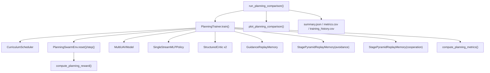

# Chat4 Readme

## 1. 第四章当前的主链定位

第四章在当前仓库中的主实现链已经收敛到：

- `src/lc/planning/`
- `experiments/planning/`
- `tests/test_planning_curriculum_envs.py`
- `tests/test_planning_reward_replay.py`

这一章的代码目标不是做高保真飞行器动力学，而是把论文中的规划层方法翻译成一个可训练、可对比、可出图、可继续桥接到控制层的实现主链。

当前方法口径已经比较明确：

- 主模型是 `MultiUAVModel`
- 主输入是 `self_state / obstacles / neighbors`
- 主动作是二维高层速度意图 `(vx, vy)`
- 方法语义是“两阶段”：先安全避障，再协同修正
- 训练主算法已经按 `TD3` 风格落地
- 训练过程叠加课程学习和分阶段金字塔经验回放

所以，第四章现在已经不是“只有骨架”，而是“主链打通、细节仍可继续论文级完善”的状态。

---

## 2. 第四章代码总览

### 2.1 配置与场景

- `src/lc/planning/configs/planning_config.py`
  - `PlanningModelConfig`
  - `PlanningExperimentConfig`
  - 定义实验难度、训练轮数、评测轮数、输入上限等基础参数

- `src/lc/envs/scenarios/configs.py`
  - `PlanningScenarioConfig`
  - 定义规划环境所需的场景字段，例如 `num_uavs / num_obstacles / stage_name / curriculum_env`

- `src/lc/envs/scenarios/presets.py`
  - `PLANNING_CURRICULUM_ENVS`
  - `build_planning_scenario()`
  - 把第四章课程学习环境固定成九个子环境：
    - `guidance_G1`
    - `guidance_G2`
    - `avoidance_A1`
    - `avoidance_A2`
    - `avoidance_A3`
    - `avoidance_A4`
    - `cooperation_C1`
    - `cooperation_C2`
    - `cooperation_C3`

### 2.2 环境层

- `src/lc/planning/envs/swarm.py`
  - `PlanningSwarmEnv`
  - 负责：
    - 构造结构化观测
    - 推进目标、障碍物、邻机状态
    - 计算 `risk / occupancy_error / formation_error / angle_error`
    - 调用奖励模块
    - 返回训练需要的 `info`

当前环境是论文方法导向的抽象环境，不是高保真多机物理仿真。

### 2.3 模型层

- `src/lc/planning/models/multi_uav_model.py`
  - `MultiUAVModelConfig`
  - `AvoidanceBackbone`
  - `CollaborativeBackbone`
  - `MultiUAVModel`

- `src/lc/planning/models/mlp_baseline.py`
  - `SingleStreamMLPPolicy`
  - 作为第四章的单流基线

### 2.4 Critic 层

- `src/lc/planning/critics/structured_critic.py`
  - `StructuredCriticConfig`
  - `StructuredCritic`
  - 输入同样遵循 `self_state / obstacles / neighbors + action`
  - 用 attention 方式做状态动作价值评估

### 2.5 奖励层

- `src/lc/planning/rewards/planning_reward.py`
  - `PlanningRewardBreakdown`
  - `compute_planning_reward()`
  - 奖励已经拆成多子项，不再是一个不可解释的混合值

### 2.6 记忆与回放层

- `src/lc/planning/memory/pyramid.py`
  - `SumTree`
  - `PrioritizedReplayBuffer`
  - `GuidanceReplayMemory`
  - `StagePyramidReplayMemory`
  - `summarize_stage_sources()`

这里已经不是单一 replay buffer，而是按阶段拆分的回放系统：

- `guidance` 使用基础优先回放 + old pool
- `avoidance` 使用三层金字塔回放
- `cooperation` 使用另一套三层金字塔回放

### 2.7 课程学习层

- `src/lc/planning/curriculum/scheduler.py`
  - `CurriculumScheduler`
  - 负责课程环境推进、回退、阶段统计

### 2.8 训练层

- `src/lc/planning/trainers/planning_trainer.py`
  - `PlanningTrainer`
  - 负责：
    - 采样
    - 回放写入
    - twin critic 更新
    - delayed actor update
    - soft update
    - 奖励子项日志
    - 课程调度联动
    - replay 统计与注意力代理输出

### 2.9 实验与绘图层

- `src/lc/planning/experiments/compare.py`
  - `run_planning_comparison()`
  - 统一组织第四章主方法、基线和消融

- `src/lc/planning/plotting/plots.py`
  - `plot_planning_comparison()`
  - 输出第四章图表

- `src/lc/entrypoints/train_planning.py`
- `src/lc/entrypoints/compare_planning.py`
  - 当前都只是简单调用 `run_planning_comparison()`

- `experiments/planning/run_chapter4_experiment.py`
  - 这是旧接口型入口
  - 它引用的 `src.lc.planning` 旧接口对象在当前主链中并不存在
  - 因此它不应再被视作第四章现行主入口

---

## 3. 第四章核心结构与模块调用关系

### 3.1 训练主链调用图

### 3.2 每一步是怎么串起来的

1. `run_planning_comparison()` 先通过 `build_planning_scenario()` 建一个基础场景。
2. 然后分别构建五组实验：
   - `task_decomposed`
   - `single_stream_mlp`
   - `without_curriculum`
   - `without_pyramid_per`
   - `uniform_replay`
3. 每组实验都新建一个 `PlanningTrainer`。
4. `PlanningTrainer.__post_init__()` 内部初始化：
   - `MultiUAVModel`
   - `target_actor`
   - `StructuredCritic` 双 Q 网络
   - `target_critic_1 / target_critic_2`
   - `SingleStreamMLPPolicy`
   - `GuidanceReplayMemory`
   - `StagePyramidReplayMemory(stage_name="avoidance")`
   - `StagePyramidReplayMemory(stage_name="cooperation")`
5. `train()` 每个 episode 会先看 `CurriculumScheduler` 当前落在哪个课程环境，再调用 `build_planning_scenario()` 更新环境场景。
6. `PlanningSwarmEnv.reset()` 返回结构化观测：
   - `self_state`
   - `obstacles`
   - `neighbors`
7. actor 选择动作：
   - 主方法走 `MultiUAVModel`
   - 基线走 `SingleStreamMLPPolicy`
8. `PlanningSwarmEnv.step()` 推进环境，并计算：
   - `risk`
   - `occupancy_error`
   - `formation_error`
   - `angle_error`
   - `rare_event_score`
   - 奖励分项
9. trainer 根据当前阶段，把 transition 写入不同 replay：
   - `guidance -> GuidanceReplayMemory`
   - `avoidance -> avoidance StagePyramidReplayMemory`
   - `cooperation -> cooperation StagePyramidReplayMemory`
10. 采样后进入 TD3 风格更新：
    - target action smoothing
    - twin critic target min
    - critic loss
    - delayed actor update
    - target network soft update
11. 每个 episode 结束后：
    - 用 `compute_planning_metrics()` 汇总 episode 指标
    - 更新 `CurriculumScheduler`
    - 记录奖励子项均值、loss、阶段历史、replay 统计
12. 实验收尾时 `compare.py`：
    - 写 `summary.json`
    - 写 `metrics.csv`
    - 写 `training_history.csv`
    - 评估复杂度泛化
    - 调用 `plot_planning_comparison()` 出图

---

## 4. 模型结构细化

### 4.1 输入结构

第四章当前已经固定为三路结构化输入：

- `self_state = [target_dx, target_dy, self_vx, self_vy]`
- `obstacles = n x [rel_x, rel_y, r]`
- `neighbors = n x [rel_x, rel_y]`

这与论文第四章方法口径一致，且代码中已经稳定使用。

### 4.2 Actor: `MultiUAVModel`

`src/lc/planning/models/multi_uav_model.py` 中的主模型是典型两阶段结构。

第一阶段 `AvoidanceBackbone`：

- `self_state` 先过 `self_embedding`
- `obstacles` 过 `obstacle_embedding`
- 用 `TransformerBlock` 做注意力汇聚
- 输出：
  - `avoid_action`
  - `safe_feature`
  - `avoid_attention`

第二阶段 `CollaborativeBackbone`：

- `neighbors` 过 `neighbor_embedding`
- `safe_feature` 过 `safe_projection`
- 再做一次 attention 聚合
- 输出：
  - `coop_residual`
  - `gate`
  - `final_action = safe_action + gate * residual`

模型额外保留了几类对后续分析很重要的中间量：

- `policy_stages()` 可以直接拿到 `safe_feature`
- `last_attention`
- `last_gate`

这说明当前实现不仅能训练，还为论文可解释性分析预留了接口。

### 4.3 Critic: `StructuredCritic`

`StructuredCritic` 的作用不是生成动作，而是评估给定动作在结构化观测下的 Q 值。

它的特点是：

- 复用 actor 的 `self / obstacle / neighbor` embedding
- 自己再对 `action` 做 embedding
- 用单头 attention 让动作 token 去关注状态上下文
- 拼接 `hidden` 和 `self_token` 之后输出标量 Q

因此它和主 actor 的输入语义是一致的，不是扁平 MLP critic。

### 4.4 基线: `SingleStreamMLPPolicy`

当前基线实现比较干净：

- 把结构化观测先展平
- 走两层 `ReLU` MLP
- 最后 `Tanh` 输出 2 维动作

它的定位是对比方法，不替代主方法。

---

## 5. 环境、奖励、课程、记忆如何配合

### 5.1 环境 `PlanningSwarmEnv`

当前环境已经具备第四章训练所需的关键能力：

- `reset()` 初始化目标、障碍物、邻机状态
- `step()` 接收二维动作并推进状态
- 根据阶段自动改变速度尺度和场景复杂度
- 维护：
  - `trajectory`
  - `target_trajectory`
  - `risk_history`
  - `occupancy_errors`
  - `formation_errors`
  - `reward_components`

阶段语义也已经进环境逻辑：

- `guidance`
  - 重点是到达目标相对位置
- `avoidance`
  - 重点是保留到达能力并学习避障
- `cooperation`
  - 重点是围绕目标进行协同占位和角度均匀性

### 5.2 奖励 `compute_planning_reward()`

奖励已经拆成七项：

- `target_reward`
- `avoidance_reward`
- `collaboration_reward`
- `recovery_reward`
- `smoothness_penalty`
- `consistency_penalty`
- `success_bonus`

而且已经按阶段切换权重：

- `guidance` 更偏向目标到达
- `avoidance` 更偏向安全避障
- `cooperation` 更偏向协同与恢复

这一点非常重要，因为它说明第四章奖励系统已经从“单个 reward 标量”升级成了“论文可解释的奖励分解”。

### 5.3 课程 `CurriculumScheduler`

课程调度已经不只是一个空壳。

当前它确实在使用：

- 滑动窗口奖励均值
- 滑动窗口奖励标准差
- 滑动窗口成功率

做三类决定：

- 保持当前课程环境
- 晋级到下一个课程环境
- 连续表现恶化时回退

它记录的东西也足够用于分析：

- `stage_history`
- `stage_metric_sums`
- `env_metric_sums`

### 5.4 记忆 `pyramid.py`

第四章 replay 现在已经有明显的分阶段结构。

`GuidanceReplayMemory`：

- 本质上是单个 `PrioritizedReplayBuffer`
- 额外维护 `old_pool`
- 阶段切换时会按成功、奖励、占位误差筛历史样本

`StagePyramidReplayMemory`：

- `avoidance`
  - `td_layer`
  - `filtered_layer`
  - `rare_layer`
  - 采样比 `6:3:1`
- `cooperation`
  - `td_layer`
  - `contribution_layer`
  - `rare_layer`
  - 采样比 `5:3:2`

并且 trainer 已经把旧阶段样本混入当前训练：

- `avoidance` 训练时可混入 `guidance old pool`
- `cooperation` 训练时可混入 `avoidance old pool`

这说明第四章的“持续学习 / 防遗忘”不是停留在文档上，而是已经进入训练闭环。

---

## 6. 当前实验入口与输出

### 6.1 主实验入口

当前真正可用的第四章主实验入口是：

- `src/lc/planning/experiments/compare.py`
  - `run_planning_comparison()`
- `src/lc/entrypoints/train_planning.py`
- `src/lc/entrypoints/compare_planning.py`

### 6.2 当前实验组

`run_planning_comparison()` 当前固定跑五组：

- `task_decomposed`
- `single_stream_mlp`
- `without_curriculum`
- `without_pyramid_per`
- `uniform_replay`

这已经覆盖了：

- 主方法 vs 基线
- 去掉课程学习
- 去掉金字塔回放
- 改成统一回放

### 6.3 输出内容

当前会写出：

- `summary.json`
- `metrics.csv`
- `training_history.csv`
- `complexity_generalization.json`

图表当前支持：

- `ablation_comparison.svg`
- `convergence_curve.svg`
- `success_collision_curve.svg`
- `formation_occupancy_curve.svg`
- `curriculum_schedule.svg`
- `complexity_generalization.svg`
- `trajectory.svg`
- `attention_heatmap.svg`

默认输出目录：

- `outputs/planning/<difficulty>/stage_<stage_index>/`

---

## 7. 当前测试覆盖了什么

### 7.1 已验证通过

我这次实际跑通了：

- `tests/test_planning_curriculum_envs.py`
  - `4 passed`
- `tests/test_planning_reward_replay.py`
  - `3 passed`

这些测试确认了：

- 九个课程环境的配置映射是通的
- scheduler 可以推进到最终合作阶段
- 环境 `info` 能返回 `curriculum_env`
- 奖励分解函数可用
- 金字塔经验池的过滤层与 old pool 混采逻辑可用

### 7.2 部分验证但未完整跑完

- `tests/test_new_architecture.py`
  - 本次在限定超时内未跑完
  - 原因是它同时覆盖控制层、规划层和桥接层，耗时明显更长

从文件内容看，和第四章直接相关的验证包括：

- `run_planning_comparison()` 能写输出
- `MultiUAVModel` 同时支持 `dict` 输入与扁平输入
- 第二阶段协同分支确实消费第一阶段 `safe_feature`

### 7.3 现有测试缺口

第四章还有几类测试明显缺少：

- trainer 的 TD3 更新正确性测试
- twin critic 与 target 更新测试
- replay 优先级回写测试
- 五组实验输出字段完整性测试
- 绘图文件存在性和字段对齐测试
- 复杂度泛化输出测试
- attention heatmap 数据一致性测试

---

## 8. 现在已经实现到什么程度

如果从“论文方法落地”角度判断，第四章当前已经实现了这些关键部分：

### 8.1 已经落地的能力

- 结构化三路输入
- 两阶段 actor
- attention critic
- TD3 风格训练闭环
- 课程学习调度
- 分阶段金字塔经验回放
- 旧阶段样本保留与混采
- 奖励拆分
- 五组实验对比
- 训练日志导出
- 多类 SVG 图表输出
- 复杂度泛化评估入口

### 8.2 目前最准确的状态判断

第四章现在已经是“可以训练、可以对比、可以出图”的版本，不再是空骨架。

但它仍然主要属于：

- 论文方法导向的工程实现版

而不是：

- 最终论文定稿级
- 高保真物理仿真级
- 大规模批量实验收敛级

---

## 9. 当前仍然缺什么

下面这些点是第四章下一步最值得继续补的地方。

### 9.1 文档与入口层存在历史残留

当前仓库里有几处第四章信息已经落后于代码真实状态：

- `README.md` 仍提到 `src/lc/planning/chapter4_interfaces.py`
- `experiments/planning/run_chapter4_experiment.py` 也依赖旧接口名

但当前主链里并没有这个现行接口文件。

这说明第四章现在真正稳定的主入口已经转到：

- `src/lc/planning/experiments/compare.py`
- `src/lc/entrypoints/train_planning.py`
- `src/lc/entrypoints/compare_planning.py`

所以后续需要统一入口叙事，避免新接手的人继续走旧接口。

### 9.2 环境仍然是抽象规划环境

当前环境适合论文方法训练与比较，但还缺：

- 更真实的多机动力学约束
- 更真实的目标机动模型
- 更真实的动态障碍运动模型
- 多智能体交互的更细粒度状态更新

也就是说，现在环境足够支撑“第四章方法代码主链”，但还不是最终高保真验证环境。

### 9.3 奖励虽已拆分，但仍偏工程口径

奖励项已经很多，但还缺：

- 与论文正文完全一一对应的公式化说明
- 更明确的参数来源说明
- 更系统的奖励系数搜索或固定依据

当前奖励是“合理且可训练”的，不一定已经是“论文最终版本”。

### 9.4 Pyramid-PER 仍可继续论文级精化

现在已经有：

- 三层结构
- old pool
- 分层采样比
- priority 更新

但还可以继续做：

- 更严格的 importance sampling 设计说明
- 更严格的层内 priority 公式论证
- 更系统的阶段遗忘评估指标
- 更多 replay 消融实验

### 9.5 实验矩阵还不够满

现在实验组已有五组，但距离完整论文矩阵还有缺口：

- `without_task_decomposition`
- 不同 memory scoring 方式
- 不同 old pool 混入比例
- 多随机种子重复实验
- 更多复杂度维度联合泛化

### 9.6 图表仍偏“工程可视化”，还可继续论文美化

当前图表已经够看趋势，但还缺：

- 更正式的图例与标签
- 多 seed 均值与方差带
- 更规范的对比图排版
- 更明确的 attention 可解释性定义

---

## 10. 后续建议按什么顺序继续做

如果继续推进第四章，我建议按这个顺序做。

### 10.1 第一优先级

- 统一第四章现行入口与文档口径
  - 让 `README`、实验入口、文档都明确以 `src/lc/planning/experiments/compare.py` 为主
  - 处理旧的 `chapter4_interfaces` 残留叙事

### 10.2 第二优先级

- 补 trainer 级单元测试
  - 验证 TD3 更新
  - 验证 replay priority 回写
  - 验证阶段切换 old pool 刷新
  - 验证五组实验输出完整性

### 10.3 第三优先级

- 扩展实验矩阵
  - 增加 `without_task_decomposition`
  - 增加 memory scoring 对比
  - 增加多 seed 统计
  - 增加更完整的复杂度泛化实验

### 10.4 第四优先级

- 强化绘图与结果导出
  - 输出更论文风格的对比图
  - 增加多 seed 置信区间
  - 增加 replay 分层占比图
  - 增加课程阶段 retention 图

### 10.5 第五优先级

- 继续推进系统桥接
  - 把规划层 `(vx, vy)` 高层意图更稳定地映射到控制层输入
  - 强化 `src/lc/integration/` 与 `experiments/integrated/` 的闭环验证

---

## 11. 推荐阅读顺序

如果后续要继续补第四章代码，建议按下面顺序读：

1. `src/lc/envs/scenarios/presets.py`
2. `src/lc/planning/envs/swarm.py`
3. `src/lc/planning/models/multi_uav_model.py`
4. `src/lc/planning/critics/structured_critic.py`
5. `src/lc/planning/rewards/planning_reward.py`
6. `src/lc/planning/memory/pyramid.py`
7. `src/lc/planning/curriculum/scheduler.py`
8. `src/lc/planning/trainers/planning_trainer.py`
9. `src/lc/planning/experiments/compare.py`
10. `src/lc/planning/plotting/plots.py`
11. `tests/test_planning_curriculum_envs.py`
12. `tests/test_planning_reward_replay.py`

---

## 12. 一句话总结

第四章当前已经形成了一条真实可运行的主链：

- 环境负责生成结构化观测与风险指标
- `MultiUAVModel` 负责“先避障、后协同”的动作生成
- `StructuredCritic` 负责结构化状态动作价值评估
- `CurriculumScheduler` 负责九环境课程推进
- `GuidanceReplayMemory + StagePyramidReplayMemory` 负责持续学习记忆
- `PlanningTrainer` 负责 TD3 风格训练闭环
- `compare.py` 负责实验组织、结果导出和图表输出

当前最需要继续做的，不是推倒重写，而是：

- 统一旧文档与现主链
- 补测试
- 扩实验
- 精化图表
- 继续把论文口径打磨成更完整的结果链
